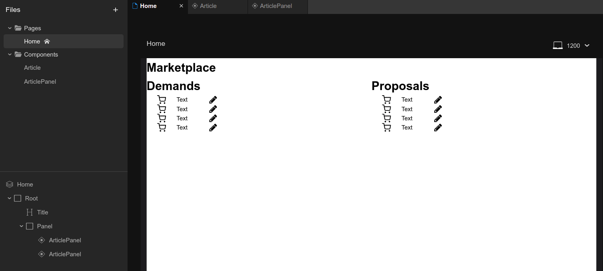

# 202310-ok-marketplace

Учебный проект курса
[Kotlin Backend Developer](https://otus.ru/lessons/kotlin/?int_source=courses_catalog&int_term=programming).
Поток курса 2023-10.

Marketplace -- это площадка, на которой пользователи выставляют предложения и потребности. Задача
площадки -- предоставить наиболее подходящие варианты в обоих случаях: для предложения -- набор вариантов с
потребностями, для потребностей -- набор вариантов с предложениями.

## Визуальная схема фронтенда

## Документация

1. Маркетинг
   1. [Заинтересанты](./docs/01-marketing/01-stakeholders.md)
   2. [Целевая аудитория](./docs/01-marketing/02-target-audience.md)
   3. [Конкурентный анализ](./docs/01-marketing/03-concurrency.md)
   4. [Анализ экономики](./docs/01-marketing/04-economy.md)
   5. [Пользовательские истории](./docs/01-marketing/05-user-stories.md)
2. DevOps
   1. [Схема инфраструктуры](./docs/02-devops/01-infrastruture.md)
   2. [Схема мониторинга](./docs/02-devops/02-monitoring.md)
3. Тесты
4. Архитектура

# Структура проекта

## Подпроекты для занятий по языку Kotlin

1. [m1l1-quickstart](m1l1-quickstart) - Вводное занятие, создание первой программы на Kotlin
2. [m1l2-basic](m1l2-basic) - Основные конструкции Kotlin
3. [m1l3-oop](m1l3-oop) - Объектно-ориентированное программирование
4. [m1l4-dsl](m1l4-dsl) - Предметно ориентированные языки (DSL)
5. [m1l5-coroutines](m1l5-coroutines) - Асинхронное и многопоточное программирование с корутинами
6. [m1l6-flows](m1l6-flows) - Асинхронное и многопоточное программирование с Flow и каналами
7. [m1l7-kmp](m1l7-kmp) - Kotlin Multiplatform и интероперабельность с JVM, JS

